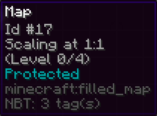

# MapCopyright

## Description
**Add Copy Protection to the map.**
**For people selling Map Art on large servers.**
**Protected players are stored in ItemMeta with PersistentDataContainer.**

Quality written in 3 hours. Not a beautiful code.



## Commands
```
/art help
/art ?
/art info
/art lock
/art unlock
```

### /art info
Display who protected the map

### /art lock
Enable Copy Protection.

### /art unlock
Remove Copy Protection.
Only for maps that you have protected yourself.

## Permissions
```
mapcopyright.ignore
mapcopyright.command
```

## Author
* Namako771

## License
MapCopyright is licensed under the [MIT](https://en.wikipedia.org/wiki/MIT_License).

Copyright (c) 2022 Namako771